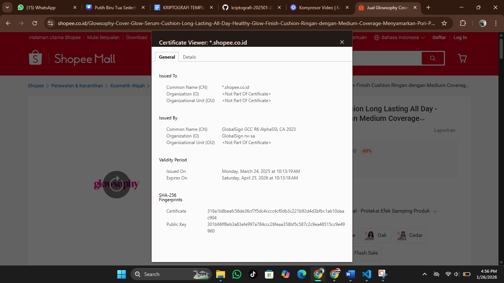

# Laporan Praktikum Kriptografi
Minggu ke-: 12  
Topik: [jAplikasi TLS & E-commerce]  
Nama: [Ayunita Thalia Nugraheni]  
NIM: [230202739]  
Kelas: [5IKRB]  

---

## 1. Tujuan
(Tuliskan tujuan pembelajaran praktikum sesuai modul.)

1. Menganalisis penggunaan kriptografi pada email dan SSL/TLS.
2. Menjelaskan enkripsi dalam transaksi e-commerce.
3. Mengevaluasi isu etika & privasi dalam penggunaan kriptografi di kehidupan sehari-hari.

---

## 2. Dasar Teori
(Ringkas teori relevan (cukup 2–3 paragraf).  
Contoh: definisi cipher klasik, konsep modular aritmetika, dll.  )

Transport Layer Security (TLS) merupakan protokol keamanan yang digunakan untuk melindungi komunikasi data antara klien dan server melalui proses enkripsi, autentikasi, dan penjagaan integritas data. TLS bekerja dengan memanfaatkan kriptografi kunci publik dan sertifikat digital untuk memastikan bahwa pihak yang berkomunikasi adalah entitas yang sah. Dengan adanya TLS, data yang dikirimkan melalui jaringan publik tidak dapat dibaca atau diubah oleh pihak yang tidak berwenang.

Dalam konteks e-commerce, TLS menjadi komponen penting untuk mengamankan transaksi online, terutama saat pengguna melakukan login, mengisi data pribadi, dan melakukan pembayaran. Penerapan TLS dalam bentuk HTTPS melindungi informasi sensitif seperti nomor kartu kredit dan data pelanggan dari ancaman seperti penyadapan dan serangan man-in-the-middle, sehingga menjaga kerahasiaan dan integritas transaksi.

Selain aspek teknis keamanan, penggunaan TLS juga berperan dalam meningkatkan kepercayaan konsumen terhadap platform e-commerce. Tanda keamanan seperti ikon gembok pada browser menunjukkan bahwa situs telah menerapkan standar keamanan yang diakui, sehingga pengguna merasa lebih aman dan nyaman dalam melakukan transaksi digital.

---

## 3. Alat dan Bahan
- Python 3.11
- Visual Studio Code / editor lain
- Git dan akun GitHub
- Library tambahan (hashlib dan time) 

---

## 4. Langkah Percobaan
(Tuliskan langkah yang dilakukan sesuai instruksi.  
Contoh format:

1. Pindah ke folder praktikum: cd praktikum/week12-aplikasi-tls/
2. Simpan screenshot: (Pastikan file sertifikat_tokopedia.png dan sertifikat_shopee.png sudah ada di folder screenshots/)
3. Tambahkan file ke git: git add .
4. Commit: git commit -m "week12-aplikasi-tls"
5. Push (Opsional): git push origin main)
---

## 5. Source Code
(Salin kode program utama yang dibuat atau dimodifikasi.  
Gunakan blok kode:

```python
# contoh potongan kode
def encrypt(text, key):
    return ...
```
)

---

## 6. Hasil dan Pembahasan
(- Lampirkan screenshot hasil eksekusi program (taruh di folder `screenshots/`).  
- Berikan tabel atau ringkasan hasil uji jika diperlukan.  
- Jelaskan apakah hasil sesuai ekspektasi.  
- Bahas error (jika ada) dan solusinya. 

Hasil eksekusi program Caesar Cipher:


)

---

## 7. Jawaban Pertanyaan
(Jawab pertanyaan diskusi yang diberikan pada modul.  
- Pertanyaan 1: Apa perbedaan utama antara HTTP dan HTTPS?

Jawab :
Perbedaan utama antara HTTP dan HTTPS terletak pada keamanan komunikasi datanya. HTTP mengirimkan data dalam bentuk teks biasa (plain text), sehingga mudah disadap atau dimodifikasi oleh pihak tidak berwenang. Sementara itu, HTTPS menggunakan TLS (Transport Layer Security) untuk mengenkripsi data yang dikirim, sehingga informasi seperti username, password, dan data transaksi terlindungi dari penyadapan dan serangan man-in-the-middle. Selain itu, HTTPS juga menyediakan autentikasi server melalui sertifikat digital, sehingga pengguna dapat memastikan bahwa mereka terhubung ke situs yang sah dan terpercaya.

- Pertanyaan 2: Mengapa sertifikat digital menjadi penting dalam komunikasi TLS?

Jawab : 
Sertifikat digital menjadi penting dalam komunikasi TLS karena berfungsi untuk memverifikasi keaslian identitas server dan mengaitkan public key dengan pemilik yang sah. Melalui sertifikat digital yang diterbitkan oleh Certificate Authority (CA) terpercaya, klien dapat memastikan bahwa mereka berkomunikasi dengan server yang benar, bukan pihak palsu. Selain itu, sertifikat digital memungkinkan pembentukan koneksi terenkripsi secara aman dan mencegah serangan seperti man-in-the-middle, sehingga menjaga kerahasiaan dan integritas data selama proses komunikasi TLS.

- Pertanyaan 3: Bagaimana kriptografi mendukung privasi dalam komunikasi digital, tetapi sekaligus menimbulkan tantangan hukum dan etika?

Jawab :
Kriptografi mendukung privasi dalam komunikasi digital dengan mengenkripsi data sehingga hanya pihak yang berwenang yang dapat membaca dan memahami isi komunikasi, yang sangat penting untuk melindungi informasi pribadi, transaksi keuangan, dan komunikasi sensitif dari penyadapan atau penyalahgunaan. Namun, di sisi lain, penggunaan kriptografi yang kuat juga menimbulkan tantangan hukum dan etika karena dapat menghambat penegakan hukum dalam mengakses data untuk kepentingan penyelidikan kejahatan. Kondisi ini memunculkan dilema antara hak atas privasi individu dan kepentingan keamanan publik, sehingga diperlukan regulasi dan kebijakan yang seimbang agar perlindungan privasi tetap terjaga tanpa mengabaikan aspek hukum dan etika.
)
---

## 8. Kesimpulan
(Tuliskan kesimpulan singkat (2–3 kalimat) berdasarkan percobaan.  )

Transport Layer Security (TLS) merupakan komponen fundamental dalam sistem e-commerce karena berperan melindungi komunikasi data antara pengguna dan server melalui enkripsi, autentikasi, dan penjagaan integritas informasi. Dengan penerapan TLS dalam bentuk HTTPS, data sensitif seperti informasi login, data pribadi, dan detail pembayaran dapat terlindungi dari ancaman penyadapan, manipulasi data, serta serangan man-in-the-middle.

Dalam lingkungan e-commerce yang melibatkan transaksi keuangan secara daring, keberadaan TLS tidak hanya berfungsi sebagai mekanisme keamanan teknis, tetapi juga sebagai sarana untuk membangun kepercayaan pengguna. Sertifikat digital yang valid memastikan keaslian identitas server, sehingga konsumen merasa aman saat berinteraksi dan melakukan transaksi pada platform e-commerce.

Secara keseluruhan, penerapan TLS menjadi standar wajib dalam e-commerce modern karena mampu menjamin keamanan dan privasi data sekaligus meningkatkan kredibilitas layanan. Tanpa TLS, risiko kebocoran data dan penurunan kepercayaan konsumen akan meningkat, yang pada akhirnya dapat merugikan baik pengguna maupun penyedia layanan e-commerce.

---

## 9. Daftar Pustaka
(Cantumkan referensi yang digunakan.  
Contoh:  
- Katz, J., & Lindell, Y. *Introduction to Modern Cryptography*.  
- Stallings, W. *Cryptography and Network Security*.  )

---

## 10. Commit Log
(Tuliskan bukti commit Git yang relevan.  
Contoh:
```
commit abc12345
Author: Ayunita Thalia Nugraheni <nitaayu857@gmail.com>
Date:   2025-01-16

    week12-aplikasi-tls)
```
