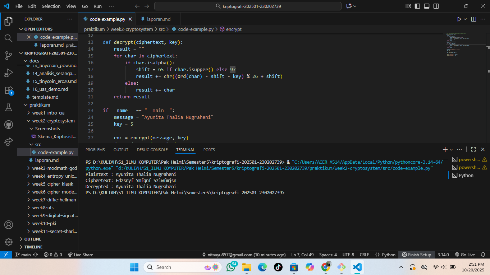
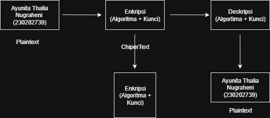

# Laporan Praktikum Kriptografi
Minggu ke-: 2 
Topik: [Cryptosystem (Komponen,Enkripsi, & Deskripsi,SImetris & Asimetris)]
Nama: Ayunita Thalia Nugraheni 
NIM: 230202739 
Kelas: 5IKRB 

---

## 1. Tujuan
1. Mengidentifikasi komponen dasar kriptosistem (plaintext, ciphertext, kunci, algoritma).
2. Menggambarkan proses enkripsi dan dekripsi sederhana.
3. Mengklasifikasikan jenis kriptosistem (simetris dan asimetris).
---

## 2. Dasar Teori
Kriptosistem adalah suatu sistem yang dirancang untuk melindungi informasi agar tidak mudah dibaca atau diubah oleh pihak yang tidak berwenang. Sistem ini bekerja dengan mengubah pesan asli (plaintext) menjadi pesan tersandi (ciphertext) menggunakan algoritma enkripsi dan kunci rahasia, lalu mengembalikannya ke bentuk semula melalui proses dekripsi.

Secara umum, kriptosistem terbagi menjadi dua kelompok, yaitu
-kriptosistem kunci simetris:(menggunakan satu kunci yang sama untuk enkripsi dan dekripsi) dan
-kriptosistem kunci asimetris:(menggunakan sepasang kunci berbeda, yaitu kunci publik dan kunci privat). Dengan demikian, kriptosistem berfungsi untuk menjaga kerahasiaan, keaslian, integritas, dan autentikasi data dalam proses komunikasi atau penyimpanan informasi.

---

## 3. Alat dan Bahan
- Phyton 3.11
- Visual Studio Code
- Git
- Akun Git yang aktif
- Draw io
  
---

## 4. Langkah Percobaan
1. Membuat diagram alur kriptosistem dasar yang menampilkan proses enkripsi dan dekripsi, kemudian menyimpannya dengan nama screenshots/diagram_kriptosistem.png.
2. Membuat program Python bernama simple_crypto.py di folder praktikum/week2-cryptosystem/src/.
3. Menulis ulang kode Caesar Cipher sederhana berdasarkan contoh yang ada di modul praktikum.
4. Menjalankan program tersebut melalui terminal dengan perintah python src/simple_crypto.py.
5. Mengambil screenshot hasil eksekusi program dan menyimpannya sebagai screenshots/hasil_eksekusi.png.
6. Menyusun laporan (laporan.md) yang mencakup seluruh bagian mulai dari tujuan, langkah-langkah percobaan, hasil, hingga pembahasan atau jawaban diskusi.
7. Terakhir, melakukan commit dan push hasil pekerjaan ke repositori GitHub dengan pesan week2-cryptosystem.
---

## 5. Source Code
def enkripsi_caesar(teks, shift):
    hasil = ""
    for char in teks:
        if char.isalpha():
            base = ord('A') if char.isupper() else ord('a')
            hasil += chr((ord(char) - base + shift) % 26 + base)
        else:
            hasil += char
    return hasil

def dekripsi_caesar(teks, shift):
    return enkripsi_caesar(teks, -shift)

# Program utama
if __name__ == "__main__":
    print("=== Simulasi Caesar Cipher ===")
    plaintext = input("Masukkan teks asli (plaintext): ")
    shift = int(input("Masukkan jumlah pergeseran (shift): "))

    ciphertext = enkripsi_caesar(plaintext, shift)
    print("\nHasil Enkripsi (ciphertext):", ciphertext)

    decrypted_text = dekripsi_caesar(ciphertext, shift)
    print("Hasil Dekripsi:", decrypted_text)

---

## 6. Hasil dan Pembahasan
Diagram tersebut menggambarkan proses dasar kerja kriptosistem, di mana pesan asli (plaintext) berupa “Ayunita Thalia Nugraheni – 230202739” dienkripsi menggunakan algoritma dan kunci untuk menghasilkan pesan tersandi (ciphertext). Ciphertext ini kemudian dapat dikembalikan ke bentuk semula melalui proses dekripsi dengan algoritma dan kunci yang sama, sehingga menghasilkan kembali plaintext yang dapat dibaca oleh penerima. Proses ini menunjukkan bagaimana kriptosistem menjaga kerahasiaan informasi melalui transformasi data menggunakan enkripsi dan dekripsi.

Hasil eksekusi program Caesar Cipher: 

<<<<<<< HEAD




=======
>>>>>>> 4193d6b6ac64cfd26e7274dee368075eb87ef1a6

---

## 7. Jawaban Pertanyaan
1.	Sebutkan  komponen utama dalam sebuah kriptosistem 
•	Plaintext : Merupakan pesan atau informasi asli yang ingin dijaga kerahasiaanya sebelum dienkripsi.
•	Chipertext : Hasil dari proses enkripsi, berp\upa pesan yang telah diubah menjadi bentuk tidak terbaca.
•	Algoritma Enkripsi : Metode atau prosedur yang digunakan untuk mengonversi plaintext menjadi chipertext dengan bantuan kunci tertentu.
•	Algortima Deskripsi : Metode yang digunakan untuk mengembalikan chipertext ke bentuk semula (plaintext) menggunakan kunci yang sesuai.
•	Kunci (Key) : Nilai rahasia yeng berperan penting dalam proses enkripsi dan deskripsikarena keamanan system sepenuhnya begrgantung pada kerahasiaan kunci ini.

2.	Apa kelebihan dan kelamahan system simetris dibandingkan asimetris? 
Sistem kriptografi simetris memiliki kelebihan yaitu proses enkripsi dan dekripsinya lebih cepat karena menggunakan satu kunci yang sama, algoritmanya sederhana sehingga efisien untuk mengenkripsi data dalam jumlah besar, serta membutuhkan sumber daya komputasi yang lebih sedikit. 
Namun, sistem ini juga memiliki kelemahan, yaitu distribusi kunci menjadi masalah karena pengirim dan penerima harus memiliki kunci yang sama dan harus menjaganya tetap aman. Selain itu, keamanan sistem akan terganggu jika kunci diketahui oleh pihak lain, dan sistem ini kurang cocok digunakan untuk komunikasi terbuka karena sulit menjamin keamanan pertukaran kunci. Sebaliknya, sistem asimetris memang lebih aman dalam hal distribusi kunci karena menggunakan kunci publik dan privat, tetapi memiliki proses yang lebih lambat dan membutuhkan daya komputasi lebih tinggi.


3.	Mengapa distribusi kunci menjadi maslash utama dalam kriptografi simetris? Distribusi kunci menjadi masalah utama dalam kriptografi simetris karena sistem ini menggunakan satu kunci yang sama untuk proses enkripsi dan dekripsi. Artinya, baik pengirim maupun penerima pesan harus memiliki kunci yang identik sebelum komunikasi dimulai. Tantangannya adalah bagaimana cara mengirimkan kunci tersebut dengan aman, agar tidak disadap atau dicuri oleh pihak yang tidak berwenang. Jika kunci berhasil diketahui oleh orang lain, maka seluruh pesan yang dienkripsi dapat dengan mudah dibuka, sehingga keamanan sistem menjadi tidak terjamin.
---

## 8. Kesimpulan
Kriptosistem merupakan sistem keamanan informasi yang berfungsi melindungi data melalui proses enkripsi dan dekripsi. Sistem ini terdiri dari beberapa komponen utama, yaitu plaintext sebagai pesan asli, ciphertext sebagai pesan yang telah disandikan, algoritma enkripsi dan dekripsi sebagai metode pengubahan data, serta kunci (key) yang mengatur proses penyandian. Berdasarkan penggunaan kuncinya, kriptosistem dibagi menjadi dua jenis, yaitu simetris dan asimetris. Kriptosistem simetris menggunakan satu kunci yang sama untuk proses enkripsi dan dekripsi, sehingga lebih cepat namun memiliki risiko pada distribusi kunci. Sementara itu, kriptosistem asimetris menggunakan dua kunci berbeda, yaitu kunci publik dan kunci privat, yang lebih aman tetapi memerlukan waktu proses lebih lama. Secara keseluruhan, kriptosistem berperan penting dalam menjaga kerahasiaan, integritas, dan keamanan data dalam komunikasi digital modern.
---

## 9. Daftar Pustaka
---

## 10. Commit Log
```
commit ddb505da8f714ffe24f5b0be486bd4cd2dadf665
Author: Ayunita Thalia Nugraheni <nitaayu857@gmail.com>
Date:   2025-10-11

    week2-cryptosystem: implementasi Caesar Cipher dan laporan )
```
