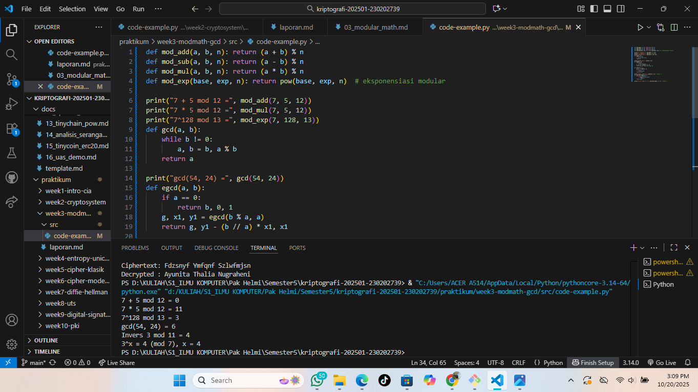

# Laporan Praktikum Kriptografi
Minggu ke-: 3 
Topik: [Modular Matha (Aritmetika Modular, GCD,Bilangan Prima,Logaritma Diskrit)]  
Nama: [Ayunita Thalia Nugraheni]  
NIM: [230202739]  
Kelas: [5IKRB]  

---

## 1. Tujuan
1. Menyelesaikan operasi aritmetika modular.
2. Menentukan bilangan prima dan menghitung GCD (Greatest Common Divisor).
3. Menerapkan logaritma diskrit sederhana dalam simulasi kriptografi.

---

## 2. Dasar Teori
Logaritma diskrit adalah konsep matematika yang mencari berapa kali suatu bilangan harus dikalikan dengan dirinya sendiri untuk menghasilkan bilangan lain dalam sistem tertentu. Nilainya sulit dihitung, terutama pada bilangan besar, sehingga sering digunakan dalam kriptografi.

Kesulitannya membuat logaritma diskrit menjadi dasar keamanan sistem seperti Diffie-Hellman dan ElGamal, karena mudah dihitung satu arah tetapi hampir mustahil dibalik, sehingga efektif melindungi data dan kunci rahasia.
---

## 3. Alat dan Bahan
- Python   
- Visual Studio Code   
- Git dan akun GitHub  
---

## 4. Langkah Percobaan  
1. Membuat struktur folder praktikum/week3-modmath-gcd/src/ dan file modular_math.py.
2. Tambahkan fungsi-fungsi aritmetika modular seperti mod_add, mod_sub, mod_mul, dan mod_exp.
3. Mengimplementasikan algoritma Euclidean buat nyari nilai GCD.
4. Mengimplementasikan dengan Extended Euclidean Algorithm (egcd) dan bikin juga fungsi invers modular (modinv).
5. Tambahkan simulasi sederhana logaritma diskrit (discrete_log) untuk nyari nilai pangkat dalam sistem modular.
6. Jalankan programnya (python src/modular_math.py) buat menguji semua fungsi yang udah dibuat.
7. Terakhir, screenshot hasil eksekusi dan simpan di folder screenshots/ sebagai bukti hasil praktikum.

---

## 5. Source Code
(Salin kode program utama yang dibuat atau dimodifikasi.  
Gunakan blok kode:

```python
# contoh potongan kode
def encrypt(text, key):
    return ...
```
)

---

## 6. Hasil dan Pembahasan
(- Lampirkan screenshot hasil eksekusi program (taruh di folder `screenshots/`).  
- Berikan tabel atau ringkasan hasil uji jika diperlukan.  
- Jelaskan apakah hasil sesuai ekspektasi.  
- Bahas error (jika ada) dan solusinya. 

Hasil eksekusi program Caesar Cipher:




)

---

## 7. Jawaban Pertanyaan
- Pertanyaan 1: Apa peran aritmatika modular dalam kriptografi modern?
  Jawab : Aritmatika modular memiliki peran yang sangat fundamental dalam kriptografi modern sebagai fondasi matematika dari berbagai sistem keamanan yang kita gunakan sehari-hari. Dalam kriptografi kunci publik, aritmatika modular menjadi dasar dari algoritma-algoritma penting seperti RSA yang menggunakan eksponen modular untuk enkripsi dan dekripsi, Diffie-Hellman yang memungkinkan pertukaran kunci rahasia melalui saluran tidak aman, serta Elliptic Curve Cryptography (ECC) yang menggunakan operasi kurva eliptik dengan aritmatika modular. Sistem-sistem ini juga digunakan dalam tanda tangan digital seperti DSA, ECDSA, dan RSA signatures untuk memverifikasi keaslian data dan identitas pengirim.
Keefektifan aritmatika modular dalam kriptografi terletak pada beberapa properti uniknya. Pertama, ia menciptakan fungsi satu arah (one-way function) di mana operasi tertentu sangat mudah dihitung namun sangat sulit untuk dibalik tanpa informasi rahasia—misalnya eksponen modular mudah dihitung tetapi logaritma diskrit sangat sulit dipecahkan. Kedua, operasi modular sangat efisien secara komputasi karena menjaga angka tetap dalam batas tertentu sehingga mencegah overflow dan mempercepat kalkulasi. Ketiga, keamanannya berbasis pada masalah matematika yang telah terbukti sulit dipecahkan bahkan dengan komputer modern. Sebagai contoh sederhana dalam RSA, jika kita memiliki p=11 dan q=13 menghasilkan n=143, maka enkripsi pesan 5 menjadi 5^7 ≡ 47 (mod 143), dan dekripsi mengembalikannya ke 47^103 ≡ 5 (mod 143). Tanpa aritmatika modular, sistem keamanan internet modern seperti HTTPS, email terenkripsi, cryptocurrency, dan berbagai aplikasi keamanan digital lainnya tidak akan mungkin ada.Coba lagiClaude dapat membuat kesalahan. Periksa kembali setiap respons. Sonnet 4.5
  
- Pertanyaan 2: Mengapa invers modular penting dalam algoritma kunci publik (misalnya RSA)?
  Jawab : Invers modular memainkan peran krusial dalam algoritma kunci publik, khususnya RSA, karena menjadi mekanisme utama yang memungkinkan proses dekripsi dan enkripsi bekerja secara matematis. Dalam RSA, kunci publik (e) dan kunci privat (d) memiliki hubungan invers modular dimana e × d ≡ 1 (mod φ(n)), yang berarti d adalah invers modular dari e. Hubungan invers ini memastikan bahwa operasi enkripsi dapat dibatalkan dengan operasi dekripsi—ketika pesan M dienkripsi menjadi C ≡ M^e (mod n), maka dekripsi C^d ≡ (M^e)^d ≡ M^(ed) ≡ M^1 ≡ M (mod n) akan mengembalikan pesan asli karena ed ≡ 1 (mod φ(n)). Tanpa konsep invers modular, tidak mungkin menciptakan sepasang kunci yang saling berkebalikan ini, dan seluruh sistem kriptografi asimetris akan runtuh. Keberadaan invers modular juga menjamin bahwa hanya pemegang kunci privat yang dapat mendekripsi pesan yang dienkripsi dengan kunci publik, sehingga menciptakan keamanan fundamental dalam komunikasi digital modern. Perhitungan invers modular menggunakan algoritma Euclidean yang diperluas, dan kemampuan untuk menghitung invers ini dengan efisien namun sulit untuk dipecahkan tanpa informasi rahasia adalah yang membuat RSA dan algoritma kunci publik lainnya sangat aman dan praktis untuk digunakan.

-Pertanyaan 3: Apa tantangan utama dalam menyelesaikan logaritma diskrit untuk modulus besar?
   Jawab : Tantangan utama dalam menyelesaikan logaritma diskrit untuk modulus besar adalah kompleksitas komputasi yang tumbuh secara eksponensial. Logaritma diskrit berusaha menemukan nilai x dalam persamaan g^x ≡ h (mod p), dimana meskipun menghitung g^x sangat mudah dan cepat, menemukan x dari hasil yang sudah diketahui menjadi sangat sulit. Untuk modulus besar yang digunakan dalam kriptografi modern (ratusan hingga ribuan bit), tidak ada algoritma efisien yang dapat menyelesaikannya dalam waktu wajar—bahkan algoritma terbaik seperti Index Calculus atau Number Field Sieve membutuhkan waktu dan sumber daya komputasi yang sangat besar. Kesulitan matematis inilah yang menjadi fondasi keamanan sistem kriptografi seperti Diffie-Hellman dan ElGamal, karena selama logaritma diskrit tetap sulit dipecahkan, sistem tersebut tetap aman. Namun, ancaman serius datang dari komputer kuantum yang secara teoritis dapat menyelesaikan logaritma diskrit dengan cepat menggunakan algoritma Shor, yang berpotensi meruntuhkan keamanan kriptografi berbasis logaritma diskrit di masa depan.Coba lagiClaude dapat membuat kesalahan. Periksa kembali setiap respons. Sonnet 4.5
  
)
---
## 8. Kesimpulan
Aritmetika modular adalah fondasi matematika kriptografi modern yang bekerja dengan sisa pembagian. Konsep utamanya meliputi operasi modular, GCD untuk menghitung invers modular, bilangan prima yang sulit difaktorkan sebagai basis keamanan RSA, dan logaritma diskrit yang mudah dihitung maju namun sulit dibalik. Keseluruhan konsep ini membentuk tulang punggung sistem keamanan digital seperti HTTPS, tanda tangan digital, dan cryptocurrency, dimana keamanannya bergantung pada masalah matematis yang sangat sulit dipecahkan secara komputasi.Coba lagiClaude dapat membuat kesalahan. Periksa kembali setiap respons.
---

## 9. Daftar Pustaka
(Cantumkan referensi yang digunakan.  
Contoh:  
- Katz, J., & Lindell, Y. *Introduction to Modern Cryptography*.  
- Stallings, W. *Cryptography and Network Security*.  )

---

## 10. Commit Log  
Contoh:
```
commit abc12345
Author: Ayunita Thalia Nugraheni  <email: nitaayu857@gmail.com>
Date:   2025-09-20

    week2-cryptosystem: implementasi Caesar Cipher dan laporan )
```
