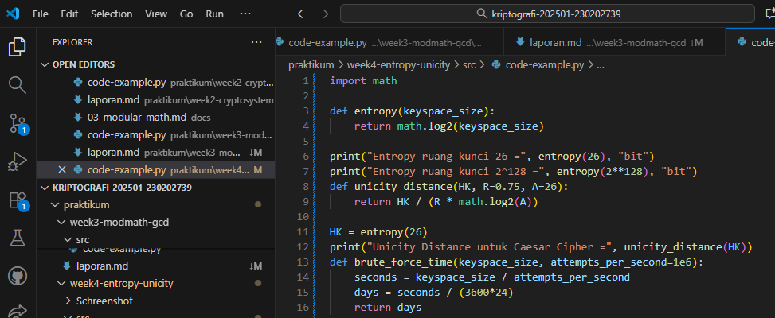

# Laporan Praktikum Kriptografi
Minggu ke-: 4  
Topik: [Entropy & Uncity Distance(Evaluasi Kekuatan Kunci dan Brute Force)]  
Nama: [Ayunita Thalia Nugraheni]  
NIM: [230202739]  
Kelas: [5IKRB]  

---

## 1. Tujuan
1. Menyelesaikan perhitungan sederhana terkait entropi kunci.
2. Menggunakan teorema Euler pada contoh perhitungan modular & invers.
3. Menghitung unicity distance untuk ciphertext tertentu.
4. Menganalisis kekuatan kunci berdasarkan entropi dan unicity distance.
5. Mengevaluasi potensi serangan brute force pada kriptosistem sederhana.

---

## 2. Dasar Teori
Aritmetika modular menciptakan fungsi satu arah yang mudah dihitung namun sulit dibalik, dengan keamanan bergantung pada ukuran modulus. Semakin besar modulus, semakin tinggi entropi (ketidakpastian) sistem dan semakin banyak kemungkinan kunci yang harus dicoba dalam brute force—misalnya RSA 2048-bit memiliki 2^2048 kemungkinan kunci yang membutuhkan miliaran tahun untuk dipecahkan. Entropi tinggi dan ruang kunci yang sangat besar inilah yang membuat kriptografi berbasis aritmetika modular praktis tidak dapat dipecahkan dengan serangan brute force.
---

## 3. Alat dan Bahan
(- Python 3.x  
- Visual Studio Code / editor lain  
- Git dan akun GitHub  
- Library tambahan (misalnya pycryptodome, jika diperlukan)  )

---

## 4. Langkah Percobaan
1. Pastikan Python sudah terinstal di sistem
2. Buka Visual Studio Code dan buat direktori baru praktikum/week4-entropy-unicity/
3. Buat file Python bernama analysis.py di dalam direktori tersebut
4. Tulis kode program dengan komponen:
-Import library math untuk operasi logaritma
-Fungsi calculate_entropy(keyspace_size) untuk menghitung entropi menggunakan math.log2()
-Fungsi calculate_unicity_distance(HK, R, A) untuk menghitung unicity distance (R=0.95, A=26)
-Fungsi analyze_brute_force_time(keyspace_size, attempts_per_second) untuk estimasi waktu serangan
5. Tambahkan kode eksekusi untuk dua skenario: kunci 16-bit (2^16) dan kunci 64-bit (2^64)
6. Jalankan program dengan perintah python analysis.py di terminal
7. Amati dan catat hasil output yang ditampilkan
Coba lagiClaude dapat membuat kesalahan. Periksa kembali setiap respons. Sonnet 4.5

---

## 5. Source Code
(Salin kode program utama yang dibuat atau dimodifikasi.  
Gunakan blok kode:

```python
# contoh potongan kode
def encrypt(text, key):
    return ...
```
)

---

## 6. Hasil dan Pembahasan
1. Entropi Kunci: Program menunjukkan bahwa entropi kunci sama dengan panjang bit kunci—kunci 16-bit memiliki entropi 16 bit dan kunci 64-bit memiliki entropi 64 bit. Ini membuktikan bahwa entropi merupakan ukuran langsung dari kompleksitas ruang kunci.
2. Unicity Distance: Untuk kunci 16-bit (dengan R=0.95 dan alfabet 26 karakter), unicity distance sekitar 3.583, artinya hanya diperlukan sekitar 4 karakter ciphertext untuk menentukan kunci 16-bit yang benar secara unik.
3. Waktu Brute Force: Perbedaan waktu serangan menunjukkan skala eksponensial keamanan kunci:
-Kunci 16-bit: Hanya 0.000001 hari (sekitar 0.065 detik), dapat dipecahkan secara instan
-Kunci 64-bit: Membutuhkan sekitar 213.5 juta hari, menunjukkan meskipun DES (64-bit) sudah tidak aman bagi organisasi besar, masih sangat kuat terhadap serangan individu dengan 1 juta percobaan per detik

Perbandingan ini menjelaskan mengapa standar modern seperti AES menggunakan kunci 128-bit atau 256-bit yang waktu brute force-nya triliunan kali lebih lama.Coba lagiClaude dapat membuat kesalahan. Periksa kembali setiap respons. Sonnet 4.5

Hasil eksekusi program Caesar Cipher:




)

---

## 7. Jawaban Pertanyaan
(Jawab pertanyaan diskusi yang diberikan pada modul.  
- Pertanyaan 1: Apa arti dari nilai entropy dalam konteks kekuatan kunci?
  Jawab : Entropi dalam konteks kekuatan kunci adalah ukuran ketidakpastian atau tingkat keacakan kunci, yang menunjukkan seberapa sulit kunci tersebut ditebak atau dipecahkan. Nilai entropi diukur dalam bit dan setara dengan panjang kunci—semakin tinggi nilai entropi, semakin banyak kemungkinan kombinasi kunci yang harus dicoba dalam serangan brute force. Misalnya, kunci dengan entropi 16 bit memiliki 2^16 (65.536) kemungkinan kombinasi, sedangkan kunci dengan entropi 64 bit memiliki 2^64 (lebih dari 18 triliun) kemungkinan kombinasi. Dengan kata lain, entropi tinggi berarti kunci lebih kuat dan lebih sulit dipecahkan karena ruang kunci yang sangat besar, sehingga membutuhkan waktu komputasi yang jauh lebih lama untuk melakukan serangan brute force.
  
- Pertanyaan 2: Mengapa unicity distance penting dalam menentukan keamanan suatu cipher?
  Jawab : Unicity distance penting dalam menentukan keamanan cipher karena menunjukkan panjang minimum ciphertext yang diperlukan untuk mengidentifikasi kunci enkripsi secara unik. Nilai ini mengindikasikan seberapa banyak data terenkripsi yang harus dikumpulkan oleh penyerang sebelum dapat menentukan kunci yang benar dengan pasti melalui analisis kriptografi. Cipher dengan unicity distance yang sangat pendek (seperti kunci 16-bit dengan unicity distance ~4 karakter) sangat lemah karena penyerang hanya memerlukan sedikit ciphertext untuk memecahkan kunci, sedangkan cipher dengan unicity distance yang panjang lebih aman karena membutuhkan lebih banyak data terenkripsi untuk analisis. Dengan kata lain, unicity distance mengukur "titik kritis" dimana keamanan cipher mulai dapat dikompromikan—semakin besar nilainya, semakin aman cipher tersebut terhadap serangan analisis kriptografi.Coba lagi

   -Pertanyaan 3 : Mengapa brute force masih menjadi ancaman meskipun algoritma sudah kuat?
  Jawab : Brute force masih menjadi ancaman meskipun algoritma sudah kuat karena beberapa faktor: pertama, kemajuan teknologi komputasi terus meningkat—komputer modern, GPU, dan teknologi khusus seperti ASIC dapat melakukan miliaran percobaan per detik, sehingga kunci yang dulu dianggap aman bisa menjadi rentan seiring waktu. Kedua, banyak implementasi nyata menggunakan kunci yang lebih pendek dari yang direkomendasikan atau password yang lemah untuk kemudahan pengguna, mengurangi ruang kunci secara drastis. Ketiga, serangan brute force dapat dikombinasikan dengan teknik lain seperti dictionary attack atau rainbow tables yang mempercepat proses. Keempat, ancaman komputasi kuantum di masa depan berpotensi mempercepat brute force secara eksponensial dengan algoritma seperti Grover's yang dapat mengurangi efektivitas panjang kunci hingga setengahnya. Oleh karena itu, meskipun algoritma seperti AES-256 secara teoritis sangat kuat, implementasi yang buruk, kunci yang lemah, atau perkembangan teknologi tetap membuat brute force menjadi ancaman yang harus diperhitungkan.Coba lagiClaude dapat membuat kesalahan. Periksa kembali setiap respons. 
)
---

## 8. Kesimpulan
Entropi dan unicity distance adalah konsep kunci dalam mengevaluasi keamanan kriptografi. Entropi mengukur kompleksitas kunci—semakin tinggi entropi, semakin besar ruang kunci dan semakin sulit dipecahkan dengan brute force (kunci 16-bit: 65.536 kemungkinan vs kunci 64-bit: 18+ triliun kemungkinan). Unicity distance menunjukkan panjang minimum ciphertext yang diperlukan untuk mengidentifikasi kunci secara unik—nilai yang pendek membuat cipher lebih rentan karena penyerang hanya butuh sedikit data untuk analisis. Analisis brute force mendemonstrasikan skala eksponensial keamanan, dimana kunci 16-bit dipecahkan dalam detik sementara kunci 64-bit membutuhkan jutaan hari. Kesimpulannya, keamanan modern memerlukan entropi tinggi (kunci panjang seperti AES 128/256-bit) dan unicity distance besar untuk membuat brute force tidak praktis, meskipun kemajuan teknologi komputasi tetap menjadi ancaman yang harus diperhitungkan.
---

## 9. Daftar Pustaka
(Cantumkan referensi yang digunakan.  
Contoh:  
- Katz, J., & Lindell, Y. *Introduction to Modern Cryptography*.  
- Stallings, W. *Cryptography and Network Security*.  )

---

## 10. Commit Log
(Tuliskan bukti commit Git yang relevan.  
Contoh:
```
commit abc12345
Author: Nama Mahasiswa <email>
Date:   2025-09-20

    week2-cryptosystem: implementasi Caesar Cipher dan laporan )
```
